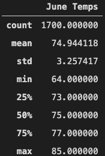
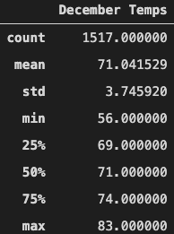

# Surfs Up Analysis

## Purpose
To determine temperature trends for the month of June and December in Oahu to determine the surf and ice cream shop business is sustainable year-round.

## Results
The results of the analysis are as follows:

 

From the above tables, we can see that there are key differences in the weather beteween June and December.

1. Min Temp: The min temp in June is 64°F. The min temp in December is 56°F. It can be far cooler in December than in June.

2. 25% percentile: The 25% percentile in June is 73°F vs 69°F in December. This is a 4 degree difference, however the spread of temperature between the min temp and the 25% percentile is far greater in December.

3. Temperature Fluctuation: The spread of temperature between min to max in June is 21°F. The spread of the temperature between min to max in December is 27°F. With the exception of the min temp, most of the other statistics are within a 2 to 4 degree range of each other. 

4. Count: This is the total number of times that the temperature was recorded for each month. For June, it is 1700. For December, it is 1517. December has 31 days in a month while June has 30 days. There was less data collected in December.

## Summary

From the above analysis, we can see that June and December temperatures are pretty similar to each other and most statistics are within a 2 to 4 degree range of each other. We also see in that the 25th percentile in December is 69°F vs 73°F in June. We see that December does experience colder weather and wilder temperature swings.

It is for the reasons above, that we can postulate that the Surf Ice cream shop sales would most likely be lower in December due to 25% of the days being below 69°F. However, since the 25 percentile of June is 73°F, and the max temps are 83°F for December, and 85°F for June, total sales/profit in December may still be close to June.

### Additional Queries
To further this weatheranalysis, we can run the following queries:

To get precipitation data for June:
```
june_results = session.query(Measurement.date, Measurement.prcp).filter(func.strftime("%m", Measurement.date) == "06").all()
june_df = pd.DataFrame(june_results, columns=['date','June Temps'])
june_df.describe()
```

To get precipitation data for December:
```
dec_results = session.query(Measurement.date, Measurement.prcp).filter(func.strftime("%m", Measurement.date) == "12").all()
dec_df = pd.DataFrame(dec_results, columns=['date','December Temps'])
dec_df.describe()
```

The resulting dataframes can be used to determine how wet each month is in comparison to another.

Another set of queries is to plot the average rainfall on each day of the month. For december, this would be the following.
```
results_date = session.query(func.avg(Measurement.prcp)).filter(func.strftime("%m", Measurement.date) == "12").group_by(func.strftime("%d", Measurement.date)).all()
date = ["12-"+str(date) for date in range(1,32)]
dec_df = pd.DataFrame(results_date, columns=['December Avg Precipitation by Date'])
dec_df['date'] = date
dec_df.set_index('date', inplace=True)
dec_df
```
The code above queries the table for the average precipitation in December, and groups all results by the date. This query and dataset can then further be used to plot the average precipitation per day in December to see how it may vary compared to June.